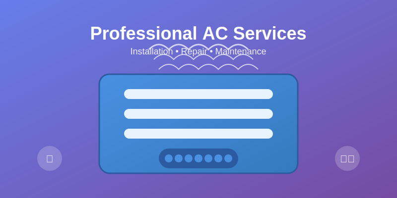

# Quick Reference: Image Integration
## JEL Air Conditioning Services

## 🚀 Quick Start

### Adding Images to New Pages
```html
<!-- Hero Image -->


<!-- Service Card Image -->


<!-- Dashboard Icon -->

```

## 📁 Available Images

### Hero Images
- `air-conditioning-hero.svg` - Main landing page hero

### Service Images
- `ac-installation.svg` - Installation service
- `ac-cleaning.svg` - Cleaning service  
- `ac-repair.svg` - Repair service

### Dashboard Images
- `system-overview.svg` - System monitoring
- `bookings.svg` - Booking management
- `customers.svg` - Customer management
- `technicians.svg` - Technician management

## 🎨 CSS Classes

```css
/* Responsive Images */
.img-fluid { max-width: 100%; height: auto; }

/* Service Cards */
.service-image { max-height: 150px; }

/* Dashboard Icons */
.dashboard-icon { width: 60px; height: 60px; }

/* Hero Images */
.hero-image { max-height: 300px; }
```

## 🔧 Customization

### Change Colors
Edit SVG files directly or use CSS:
```css
svg { fill: #your-color; }
```

### Resize Images
```css
.custom-size { width: 100px; height: 100px; }
```

## 📱 Responsive Breakpoints

- **Mobile**: < 768px - Smaller images
- **Tablet**: 768px - 1024px - Medium images  
- **Desktop**: > 1024px - Full images

## ⚡ Performance Tips

1. Use SVG for scalability
2. Optimize file sizes
3. Implement lazy loading
4. Use appropriate alt text
5. Test across devices

## 🐛 Troubleshooting

### Images Not Loading
1. Check file paths
2. Verify file permissions
3. Clear browser cache
4. Check console errors

### Images Too Large/Small
1. Adjust CSS dimensions
2. Use responsive classes
3. Check container constraints

### Poor Quality
1. Ensure SVG format
2. Check browser support
3. Verify vector graphics

---

**Need Help?** Refer to `PROFESSIONAL_IMAGES_GUIDE.md` for detailed documentation.
