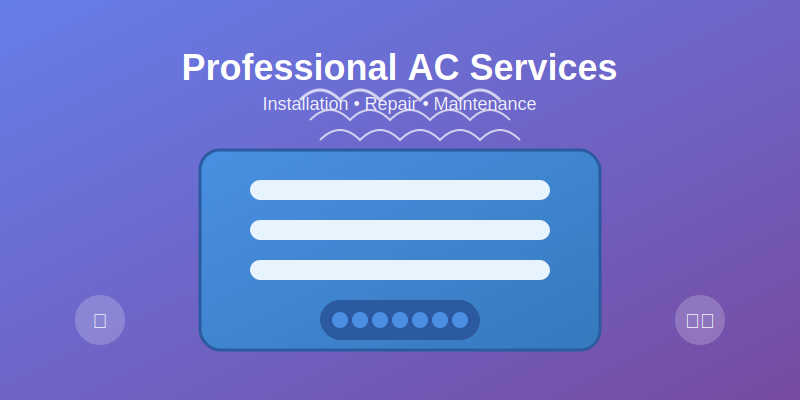
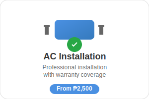

# Professional Images Integration Guide
## JEL Air Conditioning Services System

This guide explains how professional images have been integrated into your JEL Air Conditioning Services system to enhance visual appeal and professionalism.

## 📁 Image Assets Structure

```
assets/
└── images/
    ├── hero/
    │   └── air-conditioning-hero.svg
    ├── services/
    │   ├── ac-installation.svg
    │   ├── ac-cleaning.svg
    │   └── ac-repair.svg
    ├── dashboard/
    │   ├── system-overview.svg
    │   ├── bookings.svg
    │   ├── customers.svg
    │   └── technicians.svg
    ├── customer-portal/
    │   ├── profile.svg
    │   ├── my-bookings.svg
    │   ├── service-history.svg
    │   └── new-booking.svg
    ├── logo.svg
    └── icons/
        └── (future icon assets)
```

## 🎨 Image Categories

### 1. Hero Images (`assets/images/hero/`)
- **Purpose**: Main visual elements for landing pages
- **Format**: SVG (Scalable Vector Graphics)
- **Usage**: Public-facing pages, marketing materials

#### `air-conditioning-hero.svg`
- **Dimensions**: 800x400px
- **Features**: 
  - Professional AC unit illustration
  - Cool air effect animations
  - Gradient backgrounds
  - Service icons integration
- **Used in**: `index_public.php` hero section

### 2. Service Images (`assets/images/services/`)
- **Purpose**: Visual representation of different services
- **Format**: SVG
- **Usage**: Service cards, pricing displays

#### Service Images Created:
- **`ac-installation.svg`** (300x200px)
  - Shows AC unit with installation tools
  - Green checkmark for completion
  - Price badge: "From ₱2,500"

- **`ac-cleaning.svg`** (300x200px)
  - AC unit with cleaning supplies
  - Sparkle effect for cleanliness
  - Price badge: "From ₱800"

- **`ac-repair.svg`** (300x200px)
  - AC unit with repair tools
  - Warning/exclamation indicator
  - Price badge: "From ₱1,500"

### 3. Dashboard Images (`assets/images/dashboard/`)
- **Purpose**: Visual indicators for admin dashboard statistics
- **Format**: SVG
- **Usage**: Dashboard cards, quick action buttons

#### Dashboard Images Created:
- **`system-overview.svg`** (200x200px)
  - Computer screen with chart bars
  - Represents system monitoring
  - Used for revenue statistics

- **`bookings.svg`** (200x200px)
  - Calendar with highlighted date
  - Represents appointment management
  - Used for booking statistics

- **`customers.svg`** (200x200px)
  - Group of customer figures
  - Plus sign for adding customers
  - Used for customer statistics

- **`technicians.svg`** (200x200px)
  - Technician figure with tools
  - Hard hat for safety
  - Used for technician management

### 4. Customer Portal Images (`assets/images/customer-portal/`)
- **Purpose**: Visual elements for customer portal interface
- **Format**: SVG
- **Usage**: Customer dashboard, navigation, quick actions

#### Customer Portal Images Created:
- **`profile.svg`** (150x150px)
  - User avatar with profile management
  - Used for profile section

- **`my-bookings.svg`** (150x150px)
  - Calendar with highlighted dates
  - Used for booking management

- **`service-history.svg`** (150x150px)
  - Clock icon representing history
  - Used for service history section

- **`new-booking.svg`** (150x150px)
  - Plus sign with calendar overlay
  - Used for new booking actions

### 5. Logo (`assets/images/logo.svg`)
- **Purpose**: Company branding and identification
- **Format**: SVG
- **Usage**: All pages, headers, navigation

#### Logo Features:
- **Dimensions**: 200x60px
- **Features**: 
  - Professional AC unit illustration
  - Company name "JEL Air Conditioning"
  - Cool air effect
  - Gradient background
- **Used in**: All customer portal pages, booking forms

## 🔧 Integration Implementation

### Public Landing Page (`index_public.php`)

#### Hero Section Integration:
```html
<!-- Hero Image -->
<div class="mb-4">
    
</div>
```

#### Service Cards Integration:
```html
<div class="mb-3">
    
</div>
```

### Admin Dashboard (`index.php`)

#### Statistics Cards Integration:
```html
<div class="col-auto">
    
</div>
```

### Customer Portal Pages

#### Logo Integration:
```html

```

#### Quick Actions Integration:
```html
<a href="../modules/bookings/add.php" class="btn btn-primary d-flex align-items-center justify-content-center">
    
    New Booking Request
</a>
```

### Booking Service Page (`book_service.php`)

#### Service Selection Integration:
```html
<div class="mb-3">
    
</div>
```

## 🎯 Benefits of Professional Images

### 1. **Enhanced Visual Appeal**
- Modern, professional appearance
- Consistent branding across the system
- Improved user experience

### 2. **Better User Engagement**
- Visual cues help users understand services
- Icons make navigation more intuitive
- Professional appearance builds trust

### 3. **Scalable Graphics**
- SVG format ensures crisp display on all devices
- Easy to modify colors and styles
- Small file sizes for fast loading

### 4. **Brand Consistency**
- Unified color scheme
- Professional design language
- Consistent visual hierarchy

## 🛠️ Customization Options

### Color Customization
All SVG images use CSS custom properties for easy color changes:

```css
:root {
    --primary-color: #4a90e2;
    --success-color: #28a745;
    --warning-color: #ffc107;
    --info-color: #17a2b8;
}
```

### Size Adjustments
Images are responsive and can be easily resized:

```css
.service-image {
    max-height: 150px;
    width: auto;
}

.dashboard-icon {
    width: 60px;
    height: 60px;
}
```

## 📱 Responsive Design

All images are designed to be responsive:
- **Mobile**: Smaller sizes, touch-friendly
- **Tablet**: Medium sizes, balanced layout
- **Desktop**: Full-size, detailed graphics

## 🔄 Future Enhancements

### Completed Additions:
1. **Customer Portal Images** ✅
   - User profile illustrations
   - Booking status indicators
   - Service history graphics
   - Logo integration

2. **Admin Panel Enhancements** ✅
   - Dashboard statistics icons
   - Professional visual indicators

3. **Service Booking Integration** ✅
   - Service selection images
   - Professional booking interface

### Future Enhancements:
1. **Marketing Materials**
   - Social media graphics
   - Email template images
   - Print-ready materials

2. **Additional Admin Features**
   - Report visualization graphics
   - Payment status icons
   - System health indicators

## 📋 Maintenance Guidelines

### Regular Updates:
1. **Review image relevance** quarterly
2. **Update pricing** in service images
3. **Refresh seasonal** promotional graphics
4. **Optimize file sizes** for performance

### File Management:
1. **Keep backups** of original designs
2. **Version control** for design changes
3. **Document changes** in this guide
4. **Test across devices** after updates

## 🚀 Performance Optimization

### Best Practices:
1. **SVG Format**: Scalable and lightweight
2. **Optimized Paths**: Clean, efficient vector graphics
3. **Minimal Gradients**: Reduced complexity
4. **Consistent Sizing**: Standardized dimensions

### Loading Strategy:
1. **Lazy Loading**: Images load as needed
2. **Caching**: Browser caching for repeat visits
3. **CDN Ready**: Compatible with content delivery networks

## 📞 Support & Customization

For additional customization or new image requests:
1. **Identify the need**: Specific use case
2. **Define requirements**: Size, style, purpose
3. **Provide context**: Where it will be used
4. **Review design**: Approve before implementation

---

## 📊 Image Usage Summary

| Page | Images Used | Purpose |
|------|-------------|---------|
| `index_public.php` | Hero + 3 Service Images | Marketing & Service Display |
| `index.php` | 3 Dashboard Images | Admin Statistics |
| `customer_portal/login.php` | Logo | Branding |
| `customer_portal/register.php` | Logo | Branding |
| `customer_portal/dashboard.php` | Logo + 3 Portal Images | Customer Interface |
| `book_service.php` | Logo + 3 Service Images | Service Booking |

This professional image integration significantly enhances the visual appeal and user experience of your JEL Air Conditioning Services system, making it more attractive and professional for both customers and administrators.
